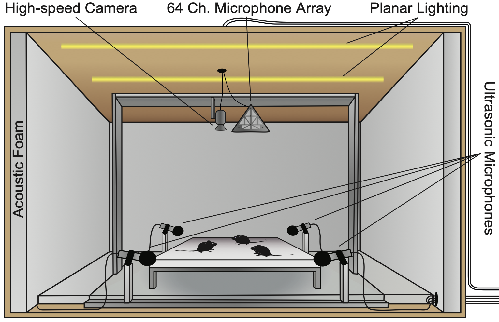
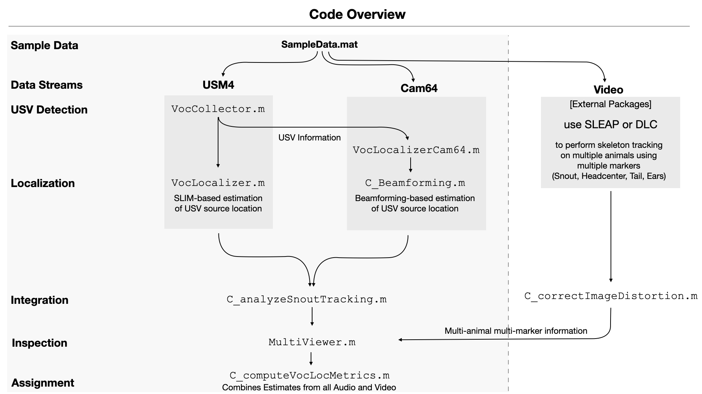

# HyVL - Hybrid Vocalization Localizer
The HyVL system relies on specific hardware and software for achieving high accuracy sound localization. We provide guides here for the hardware setup, documentation of the core functions and a sample data analysis pipeline. The present guide assumes that different labs will use different pipelines, programming languages and hardware components, and thus tries to describe general guidelines, rather than minutely reproduce our setup (which is documented in the publication). 

# Hardware Setup
The hardware setup can generally be divided into two components, the high-fidelity microphone setup, the Cam64 setup and the video camera setup. While we provide some details regarding our choice of hardware, the specific devices are of course exchangeable and can be adapted to the specific lab. 
It is generally preferable to keep the whole setup inside a sound attenuated booth with sound absorbing foam on the inside, to avoid echos/reflections of the sound and outside sounds from contaminating the recording.
Since multiple data sources are being acquired with substantial data throughput each, which puts the computer under considerable load, it is recommendable to not use the computer for other tasks during the acquisition process.
Generally, all measurements are supplied in units of meters to avoid conversion problems.

## High-Fidelity Microphone Setup
An array of high-fidelity ultrasonic microphones forms the basis for the acquisition of the audio data for USV detection and SLIM sound localization. While the geometry of the array and the number of microphones can be chosen rather freely (our code in VocLocalizer.m adapts to these), the accuracy of the design is essential for high-precision localization. 
- Number of Microphones: 3 is the required minimum, but the more the better. We used 4 microphones, but expect that each additional microphone will increase the spatial resolution further.
- Type of Microphone: We used Avisoft CMPA/16 microphones due to their high degree of spectral range and flatness, high sensitivity and possibility to directly output to DAQ hardware. Using USB-based microphones is also possible but would require additional synchronization, similar to the synchronization for Cam64 (see below). 
- Sampling Rate: 250 kHz or more should be sufficient in mice and rodents.
- Positioning: The positioning of the microphones can be customized by the user and tailored to the recording environment. The specific positions are then passed to the VocLocalizer, which takes the specific positions into account.

For positioning, the main limitations to take into account are: 
  - The locations of the microphones should encompass the recording area to maximize runtime differences.
   -The microphones should be placed higher than the platform to avoid sound absorption by the bodies of the mice.
  - Ultrasound is rather directional, therefore the microphones should be distributed in a way to maximize the chance of being in the direction of vocalization of the mice.

## Cam64 Setup
The Cam64 performs the acquisition of the high-channel count audio data which is then used for beamforming, on the basis of the detected USV times and frequency ranges.
- Sampling Rate: 250 kHz is the maximal SR supported by the Cam64 and an excellent fit for the recordings of mouse USVs.
- Positioning: The Cam64 should be installed directly above the platform. For simplicity the base of the Cam64 should be parallel to the surface of the interaction platform. Importantly, minimize all deviations/rotations of the Cam64, which will otherwise impact accuracy later. The distance of the Cam64 to the platform should be as small as possible to improve the SNR or the vocalizations. We used a distance of 46.5cm, but a small distance would likely have resulted in better SNR of the USVs.
- Cam64 internal camera: The camera of the Cam64 is in principle able to provide images for later video tracking. We, however, noticed that the camera acquisition creates a high-frequency noise, in the range of about 50kHz, and thus interferes with audio recording of USVs. In addition, the frames from the Cam64 camera are not precisely timed, and thus will only be approximately aligned to the audio data. We therefore chose to use an external camera instead.

## Video Camera Setup
The Video camera setup can be customized to the specific models/systems available in the lab. We used a PointGrey monochrome camera, which was supported by the image acquisition toolbox in Matlab and allowed for triggering of individual frames.
- Positioning: The camera should be placed with the line of sight orthogonal to the platform, in order to avoid any spatial non-uniformities/scalings in different locations of the image.
- Lighting: In our experiments we used white lighting which seemed to not irritate the mice, however, some researchers might prefer (infra)red light, which is less or invisible to the mice and thus interferes less with their natural nocturnal behavior. White light can provide advantages for tracking using a color camera (see below).
- Camera settings: To simplify later tracking, we would recommend to use high resolution acquisition from the start. In hindsight, our resolution (640x512) was likely on the low end and tracking would improve with higher resolution. Also, using a color camera will provide additional information in the different channels, which can be beneficial for tracking in particular during close interaction. We used a framerate of 50 fps, which appears to have been a good choice. Exposure duration should be kept short in order to avoid blurring the images.

## Integration and Synchronization
Synchronization between the different data sources is essential, given that the behavior or the mice is rather rapid and the duration of the USVs rather short, down to 10 ms. Since the different data sources required different synchronization strategies, we detail them separately here.

### Temporal Synchronization
Overall we recommend using a single data acquisition device that maintains a global, precise time, which all other devices are then synchronized to. We used an NI DAQ card (NI-6321), which acquired synchronization pulses at 10 kHz and provided trigger pulses to other devices . 
- USM4 Data: We used a second NI DAQ (NI-6259) card to acquire 4 channels of audio at 250 kHz. Both cards were synched internally and linked through a trigger cable. The acquisition process should be triggered/aligned precisely to the synchronization process on the first card.
- Cam64 Data: The Cam64 system does not support precisely times/triggered starting. As an alternative one therefore needs to provide an acoustic synchronization pulse. This can be achieved by placing a miniature speaker (e.g. old in-ear headphone driver) next to one of the microphones and providing a very brief sound (e.g. rapid voltage step). The speaker can be directly connected to an digital output on the DAQ card, without the need of an additional amplifier. We provide a spatial mapping of the Cam64 microphones here, for choosing and later identifying a suitable microphone. We chose microphone 58 on the outside of the array.
- Video Data: The video camera acquired a single image per TTL pulse it received and also provided a TTL pulse to confirm the acquisition of the device. These pulses were all provided and acquired by the main DAQ-card. This allows post-hoc precise timing of each frame. Importantly, frame loss can sometimes occur, which is not visible on the level of these triggers, e.g. if the USB interface drops frames. The driver of the Image Acquisition Toolbox provides the timing of the received frames, which can be compared to the triggered frames to identify the missing frames.

### Spatial Synchronization
We converted all estimates to a general coordinate system whose origin was placed in the center of the interaction platform. This simplified later integration of all spatial estimates.
- USM4 Data: The estimates between every pair of microphones generates an estimate on line connecting the microphones, specifically on the height of the platform. These estimates are combined in VocCollector and based on the microphone positions (which are in the coordinates mentioned above) to a single estimate on the platform (or rather, elevated by about 1cm to the height of the snout of the mice).
- Cam64 Data: The estimates of the Cam64 are simply shifted by the position of the Cam64 relative to the platform to obtain them in the coordinates mentioned above.
- Video Data: An important step in this transition from pixel-coordinates to flat, Euclidean coordinates is to unwarp any lens-distortions of the acquired image. In our case, the camera/lens was already relatively flat and only mild unwarping was required. We provide multiple functions for this purpose in the repository (`C_correctImageDistortion`, `C_correctImageDistortion_V1_1`).

# Data Analysis
The main challenge in the analysis is to maintain a high accuracy through the entire pipeline. The overall steps in the pipeline initially treat the data from the different data sources independently and successively integrate them (see below for overview of the data flows and the involved functions). 

Importantly, while we here provide the functions that we use for the analysis, we presume that users will integrate them in various ways in their respective analysis/acquisition pipelines, and hence, we do not attempt to provide a fully general, independent system, but instead focus the description on a sample data set, that can be used for exploring the analysis. 

## Audio Tracking
The detection and localization of the USVs progressed in a few steps. In addition to the information provided in the manuscript we here provide more direct and practical links to the code used in the analysis.

### Vocalization Detection
We used a custom USV detection algorithm, extending the classical algorithm by Holy & Gua (2005). There are by now more recent systems, such as DeepSqueak or DAS and while our code has worked rather reliably in our hands, we strongly recommend users to use more recent, DNN-based techniques for detecting USVs. 
Generally, it is likely recommendable to perform vocalization detection on the USM4 data, due to its superior SNR for high frequencies. In our algorithm, USVs are first detected on individual channels and the detected USVs later fused across channels, based on a number of timing criteria. The function call used for this purpose is `VocCollector.m`.
VocCollector accepts multiple input formats, all passed in the typical format of Name,Value pairs. In our integrated toolchain, recordings can be directly loaded and processed by specifying the animal and recording number. For the purpose of this tutorial it makes more sense to instead based it on passed data, such as the one you might have acquired.

`Vocs = VocCollector('Data',D,'SRAI',SR);`

where D is just an N_Steps x N_Microphone matrix containing the USM4 data, and SR is the sampling rate of the data. VocCollector accepts multiple additional arguments, which are documented inside the function. The default settings have worked well for us in the past.
A struct Vocs is returned with an entry for each vocalization detected. The struct has a number of fields, namely
- Start: Start time of vocalization
- Stop: Stop time of the vocalization
- StartWin: Start time of the overall window over which the sound has been cutout
- StopWin: Stop time of the overall window over which the sound has been cutout
- Duration: Duration of the USV in seconds
- Sound: Raw data from all channels
- Time: Time vector for the sound data
- Spec: Spectrogram for the Vocalization

### USM4/SLIM Localization
The code for SLIM localization (see Stahl et al. Scientific Reports, 2023 for details) based on the high-fidelity microphone data is contained in the function `VocLocalizer.m`, which is called by `VocAnalyzer.m` interally. While we use 4 microphones here, the code fully generalizes to N microphones in arbitrary positions relative to the platform. The localization is called per USV.

`Vocs = VocAnalyzer(Vocs,'MicrophonePositions',MP,'SourceHeight',SH);`

where the microphone positions MP are supplied as a cell with as many entries as microphones and each entry has three coordinates [X,Y,Z] in units of meters. Importantly, the source height, e.g. in our case 1 cm above the platform needs to be supplied for appropriately constraining the method.
VocLocalizer accepts multiple additional arguments/options, which are documented inside the function itself. One useful function is Plot, which shows the microphone positions in relation to the estimated source location. 
To minimize the occurrence of spurious localizations, we recommend applying SLIM to multiple shorter sections of the vocalization and then defining the median of the resulting localization estimates at the final localization estimate.
For testing and playing around with VocLocalizer, the function TestVocLocalizer can be used, which allows ground truth data to be supplied for testing the accuracy of VocLocalizer, including visualization of the results.

### Cam64/Beamforming Localization
The code for beamforming is essentially wrapping around the classical algorithm beamforming algorithm known as 'Delay and Sum', implemented to use either CPU or GPU and implementing the coarse/fine approach employed in HyVL (mainly to speed up localization times/minimize computation). The core function is C_BeamformingTime, which, in our toolchain is called from within C_collectCam64forVocs, which handles a number of synchronization, post-processing and plotting tasks, but is rather tightly linked to our toolchain and thus likely not very useful in its entirety to others. We have therefore written a reduced interface function `VocLocalizerCam64.m`, which provides a similar interface as VocLocalizer, but for Cam64 data.

`R = C_BeamformingTime('Data',D,'SR',SR,'MicrophonePositions',MP,'Method','DelaySumGPU','ZDist',ZDist);`

The data D is the raw sound data from the Cam64, ideally already cut to only contain the vocalization in the sampling rate SR. The distance to the localization plane also has to be provided as ZDist, which equals the height of the the Cam64 above the platform minus the height of the source above the platform. Again, the microphone positions have to be supplied as MP, this time for the Cam64. The internal positions have been mapped in the function C_mapCam64, but they need to still be shifted based on the specific position of your Cam64 setup. `C_BeamformingTime.m` accepts a number of parameters that help configure/improve the quality of Localizations, specifically:
- FRange: Bandpass frequency range (min,max in Hz) to filter the signal. This is useful to both avoid low frequency sounds (foot steps, scratching etc), and high frequency noise (from the MEMS microphones themselves).
- XRange: X limits of the (min, max, in meters) beamforming grid
- YRange: Y limits of the (min, max, in meters) beamforming grid
- XStep: X step size of the beamforming grid (in meters)
- YStep: Y step size of the beamforming grid (in meters)

Internally, C_BeamformingTime calls either `nearfieldDelayAndSUM` (CPU) or `nearfieldDelayAndSumGPU2` (for NVIDIA GPUs), which can be selected by supplying the 'Method' option as either 'DelaySum' or 'DelaySumGPU', respectively. GPU computation leads to a huge speedup (>100x typically) and is highly recommended. 
The structure R is returned, which contains a map of the sound field `ProjectionXY`, in the resolution that was supplied to the system, given as the additional fields x and y.  

## Video Tracking
We used both manual and automatic tracking of mice. For automatic tracking, DeepLabCut and SLEAP were used on the basis of 6 body markers (Snout, Headcenter, Left Ear, Right Ear, Tailstart, Body Center), annotated about 1000 frames and trained both systems. In our hands, skeleton tracking did not work as expected in DLC, and therefore we initially wrote custom post processing code () that allowed more reliable tracking of individuals. Later, we switched to SLEAP which provided more reliable tracking of individual mice over longer periods (although still a number of switches occurred). As these tracking systems are evolving quickly, our experience is likely exceeded already by the time you are reading this. The tracking data from either of the tracking approaches was reformatted from the pixel locations.

## Fusion of Audio and Video Tracking
We provide a visual tool `MultiViewer` that serves to display the data and the associated results. In order to use it, the data needs to be brought in a particular format. While it would be a lengthy task to describe this format, we provide a sample data set below, which is then processed using the functions above to create the data displayed in MultiViewer.

# Sample Data
The sample data that we provide for the purpose of this repository is an excerpt of one of our recordings, in order to keep the processing/data requirements low for the purpose of this tutorial.
